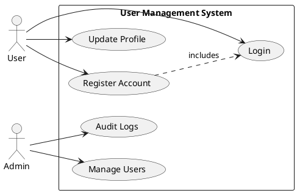

# System Design Diagram Generation with OpenAI

## Overview

The Gci409 System Design Studio now includes a sophisticated diagram generation system powered by OpenAI. The system automatically generates high-quality UML diagrams, architecture documentation, API design specifications, and database schemas from project requirements and constraints.

## Architecture

### Key Components

1. **DiagramPromptBuilder.cs**
   - Static utility class that builds specialized, efficient prompts for each diagram type
   - Provides method `BuildDiagramGuidance()` with universal diagram quality rules
   - Implements `BuildSpecializedPrompt(ArtifactKind, projectName, requirements, constraints)` for type-specific prompts
   - Each diagram type receives tailored instructions optimized for OpenAI's generation quality

2. **OpenAiArtifactGenerationEngine.cs** (Enhanced)
   - Core generation orchestrator that processes artifact requests
   - New workflow: Each artifact kind is generated with its specialized prompt
   - Per-artifact error handling allows partial generation success
   - Uses `BuildSpecializedUserPrompt()` with tailored prompts via DiagramPromptBuilder
   - System prompt emphasizes architectural expertise and quality standards

3. **DiagramValidator.cs**
   - Validates generated diagram syntax and content quality
   - Format-specific validators for PlantUml, Mermaid, and Markdown
   - Diagram-type-specific validation (e.g., UseCase diagrams must have actors/use cases)
   - Returns detailed validation results with error messages

### Generation Pipeline

```
User Request (Requirements + Constraints)
    ↓
GenerationService.QueueAsync()
    ↓
Worker: ProcessNextQueuedAsync()
    ↓
OpenAiArtifactGenerationEngine.GenerateAsync()
    ├──→ For Each Artifact Kind:
    │   ├──→ DiagramPromptBuilder.BuildSpecializedPrompt()
    │   ├──→ OpenAI API Call (with specialized prompt)
    │   ├──→ Parse JSON Response
    │   ├──→ DiagramValidator.Validate()
    │   └──→ MapArtifact() → ArtifactDraft
    │
    └──→ Store Drafts in Database
    ↓
GeneratedArtifact + ArtifactVersion saved
    ↓
User can export/review via UI
```

## Supported Diagram Types

### UML Diagrams (PlantUml + Mermaid)
- **Use Case Diagram** - Actors, use cases, system boundaries
- **Class Diagram** - Domain model, inheritance, associations
- **Sequence Diagram** - Interaction flows, message ordering
- **Activity Diagram** - Workflows, parallel flows, decision points
- **Component Diagram** - System decomposition, interfaces, dependencies
- **Deployment Diagram** - Hardware, nodes, deployment architecture

### System Diagrams (Mermaid)
- **Context Diagram** - System in context with external entities
- **Data Flow Diagram** - Process flows, data stores, movements
- **Entity-Relationship Diagram** - Database schema, relationships

### Documentation (Markdown)
- **Architecture Summary** - Patterns, layers, design decisions
- **Module Decomposition** - Module responsibilities, dependencies
- **API Design Suggestion** - Endpoints, schemas, authentication
- **Database Design Suggestion** - Storage strategy, optimization, scalability

## Efficient Prompt Engineering

### System Prompt
Establishes the AI as a principal software architect with expertise across multiple domains. Emphasizes:
- Concrete, implementation-useful artifacts (not templates)
- Syntactically valid notation for diagrams
- Domain-specific content (not generic)
- Integration of fintech/compliance/security concerns

### Specialized User Prompts

Each diagram type receives a tailored prompt including:

1. **Task Definition** - Clear, specific goal (e.g., "Generate a Use Case Diagram")

2. **Context Section** - Project name, summary, requirements, constraints

3. **Specialized Instructions** - Diagram-type-specific guidance:
   - Use Case: Identify actors, extract use cases, show relationships
   - Class: Extract entities, define properties, model relationships
   - Sequence: Pick primary flow, list participants, show messages
   - Activity: Model processes, include decision nodes, parallel flows
   - Component: Decompose into services, show interfaces, dependencies
   - Deployment: Map nodes, artifacts, communication paths
   - Context: Central system + external entities + relationships
   - DFD: Processes, data stores, flows, labels
   - ERD: Entities, attributes, relationships, normalization

4. **Quality Criteria** - Specific, measurable quality standards (e.g., 5-12 use cases for clarity)

5. **General Guidance** - Syntax rules, layout recommendations, semantic accuracy

### Quality Rules Applied

```
DIAGRAM GENERATION RULES:

1. SYNTAX VALIDATION:
   - Mermaid: Valid mermaid-js v10+ syntax
   - PlantUml: Valid UML notation with @startuml/@enduml
   - Special characters properly escaped
   - Minimal comments for clarity

2. SEMANTIC ACCURACY:
   - Reflects actual components from requirements
   - Uses meaningful names aligned with domain
   - Groups related elements logically
   - Avoids generic placeholders

3. LAYOUT & READABILITY:
   - 15-20 elements maximum for clarity
   - Clear directional flow
   - Consistent naming conventions

4. CONSTRAINT INTEGRATION:
   - Performance requirements reflected in architecture
   - Security/compliance constraints in relationships
   - Integration points for external systems
   - Data flow restricted by regulations
```

## Usage

### Example: Generate System Design Artifacts

```csharp
// In GenerationController or via UI
var request = new QueueGenerationRequest(
    new[] {
        ArtifactKind.UseCaseDiagram,
        ArtifactKind.ClassDiagram,
        ArtifactKind.ContextDiagram,
        ArtifactKind.ArchitectureSummary,
        ArtifactKind.ApiDesignSuggestion
    },
    preferredFormat: OutputFormat.Mermaid  // for diagrams; ignored for docs
);

var response = await generationService.QueueAsync(projectId, userId, request);
// Returns GenerationRequestResponse with status and targets
```

### Example: Generated Artifacts

**Use Case Diagram** (PlantUml):


**Architecture Summary** (Markdown):
```markdown
## Overview
The system implements a layered microservices architecture with modular 
separation of concerns. Services communicate via REST APIs with asynchronous 
event publishing for cross-service notifications.

## Architectural Patterns
- Layered Architecture (Presentation → Business Logic → Data Access → Infrastructure)
- Microservices decomposition for independent scaling
- API-Gateway pattern for client requests

## System Layers
### Presentation Layer
REST API controllers, DTOs, request/response processing

### Business Logic Layer
Domain services, validation, business rules enforcement

### Data Access Layer
Entity Framework Core, repository pattern, unit of work

### Infrastructure Layer
OpenAI integration, external APIs, logging, security
```

## Configuration

### Appsettings.json (Backend)

```json
{
  "OpenAi": {
    "Enabled": true,
    "ApiKey": "sk-...",
    "ApiBaseUrl": "https://api.openai.com/v1",
    "GenerationModel": "gpt-4-turbo",
    "Temperature": 0.7
  }
}
```

### Environment Variables

```bash
OPENAI_API_KEY=sk-...
OPENAI_GENERATION_MODEL=gpt-4-turbo
```

## Performance Considerations

1. **Per-Artifact Generation** - Each diagram type is generated separately, allowing:
   - Specific prompt optimization
   - Granular error handling
   - Potential parallel execution
   - Better quality control

2. **Caching** - Generated artifacts are versioned and stored:
   - No regeneration on request
   - Full audit trail via versions
   - User can compare versions

3. **Cost Optimization**:
   - Specialized prompts reduce token usage vs. batch generation
   - Focused instructions improve acceptance rate
   - Fewer API calls due to per-artifact specificity

4. **Worker Processing**:
   - Asynchronous generation via background worker
   - Doesn't block UI/API
   - Failed generations don't halt other artifacts

## Extending the System

### Adding a New Diagram Type

1. Add enum value to `ArtifactKind` (Domain/Artifacts/ArtifactModels.cs)
2. Create specialized prompt method in `DiagramPromptBuilder.cs`
3. Add case to `BuildSpecializedPrompt()` switch
4. Add validation method to `DiagramValidator.cs`
5. Add UML type mapping to `OpenAiArtifactGenerationEngine.cs` (resolution)

### Customizing a Diagram Prompt

Edit the appropriate method in `DiagramPromptBuilder.cs`:
```csharp
private static string BuildUseCaseDiagramPrompt(...) {
    // Modify instructions, quality criteria, examples
}
```

## Error Handling

**Generation Failures:**
- Per-artifact errors don't fail entire request
- Failed artifacts logged with reason
- User notified of partial results
- Retry mechanism available for individual artifacts

**Validation Failures:**
- Syntax errors reported to user
- Content too short/generic flagged
- Type mismatches (e.g., missing actors in use case) caught

## Monitoring & Quality

Generated artifacts are logged with:
- Prompt used (for reproducibility)
- OpenAI tokens consumed
- Generation time
- Validation results
- User feedback (approve/reject)

This enables:
- Cost tracking per artifact type
- Performance optimization
- Quality metrics improvement
- Model selection (gpt-4 vs gpt-4-turbo vs gpt-3.5)

## Next Steps

1. **Automatic Refinement** - If validation fails, automatically refine with corrective prompt
2. **Custom Prompts** - Allow users to provide custom prompts for specialized artifacts
3. **Multi-Format Export** - Convert any diagram to PDF/PNG via rendering service
4. **Diagramming Libraries** - Integrate Kroki, PlantUML Server for server-side rendering
5. **Feedback Loop** - Track accepted vs. rejected artifacts to fine-tune generation quality
